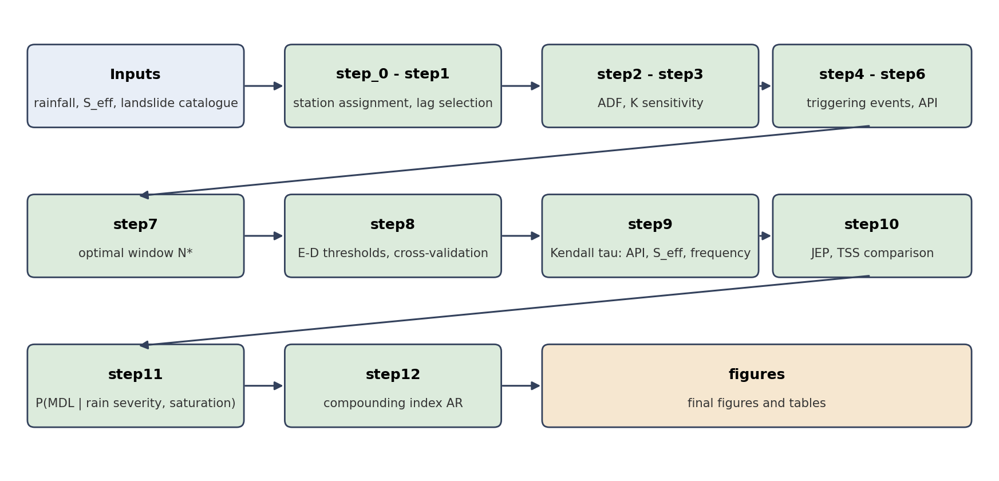
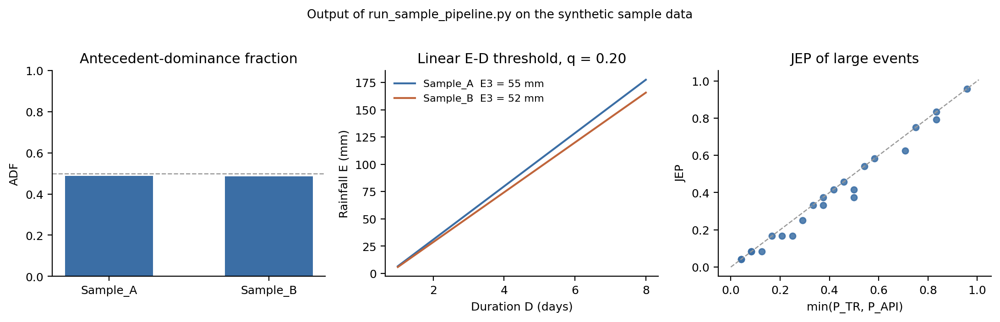

# Moisture-aware rainfall thresholds for moisture-driven landslides in the Northeastern Himalaya

[](https://github.com/danishmonga8/neh_mdl_moisture_thresholds/actions/workflows/sample-pipeline.yml)
[](LICENSE)
   

This repository contains the code used to analyse moisture-driven landslides (MDLs) at 21 rain-gauge stations in the Northeastern Himalaya (NEH), 2007-2021. It combines triggering rainfall (TR), antecedent precipitation (API) and root-zone effective saturation (S_eff) to

1. quantify how strongly antecedent wetness, rather than triggering rainfall, dominates landslide events (antecedent-dominance fraction, ADF);
2. derive station-wise energy-duration (E-D) rainfall thresholds;
3. estimate the joint probability of triggering rainfall and antecedent wetness for large landslides (JEP);
4. estimate how much wet root-zone conditions raise the likelihood of a landslide given heavy rain (compounding index, AR), and compare rainfall-only with rainfall-plus-saturation models (TSS).

## Workflow



## Repository structure

```
code/
  startup.m                  adds all MATLAB folders to the path
  neh_root.m                 returns the data root (NEH_ROOT or ./data)
  step_0_landslide_filtering/   station-landslide assignment, overlap handling, radius sensitivity
  step1_lag_selection/          lag selection from S_eff
  step2_adf_correction/         ADF
  step3_k_sensitivity/          ADF sensitivity to the API decay constant K
  step4_last_day_of_trigging/   last day of triggering rainfall
  step5_crozier_outputs/        API (Crozier) for several K
  step6_trigging_events/        triggering-event characteristics
  step7_lag_selection_updated/  optimal window N*
  step8_ed_threshold/           linear and power-law E-D thresholds, cross-validation, maps
  step9_api_seff_lf_correlation_updated/   Kendall tau analyses
  step10_jep_updated/           JEP, bootstrap, TSS protocol (Python)
  step11_MDL_likelihood/        P(MDL | rain severity, saturation)
  step12_ar_updated/            compounding index AR
  figures/                      Python scripts for the final figures and tables
sample_data/                    synthetic example data and a runnable mini pipeline
docs/
  input_data.md                 required inputs and file formats
  images/                       workflow diagram and sample-data figure
  make_images.py                regenerates the two images
  path_reference.md             files read and written by each MATLAB script
requirements.txt                Python dependencies
```

## Methods in brief

| Quantity | Definition |
|---|---|
| Study design | 21 stations, 2007-2021 landslides; rainfall and S_eff to 2019 |
| Landslide assignment | A catalogue landslide is assigned to every station within the analysis radius of 20 km. Landslides inside the radius of several stations are counted at each, so station counts are not independent. |
| API | API(N, K) = sum over i = 1..N of K^i P(t-i), with K = 0.90 and candidate windows N = 3, 5, 7, 11, 15, 21, 25, 30 days |
| Optimal window N* | Window with the highest Kendall tau-b between API(N) and lag-1 S_eff |
| ADF | Share of landslide events in which rank(API)/(n+1) exceeds rank(TR)/(n+1); tied values get average ranks (tolerance 1e-12) |
| E-D threshold | Linear quantile regression E = a + bD at quantile 0.20; E3 = a + 3b. Compared with a power law by five-fold cross-validation (RMSE, pinball loss) |
| JEP | Number of large events with TR and API both not exceeding the event, divided by N + 1; never larger than either marginal probability |
| AR | p(R_high and S >= q80) / p(R_high), p = (L + 0.5)/(N + 1); 95% intervals by year-block bootstrap |
| TSS | True skill statistic of rainfall-only and rainfall-plus-saturation logistic models, leave-one-year-out, JJAS, bootstrap intervals |
| Low-sample stations | Stations with 15 or fewer assigned landslides (Imphal, Kiphira, Nangpoh, Tuensang) are shown in grey and left out of interpreted spatial summaries |

## Requirements

- MATLAB with the Statistics and Machine Learning Toolbox (and the Mapping Toolbox for the maps).
- Python 3.9 or later:

```
pip install -r requirements.txt
```

## Data

The analysis uses daily gridded rainfall (IMD), root-zone effective saturation derived from GLEAM soil moisture, and a landslide catalogue merged from COOLR, UGLC and GFLD records. These files are not redistributed here; obtain them from the original providers and place them under the data root as described in [`docs/input_data.md`](docs/input_data.md). The per-script list of files is in [`docs/path_reference.md`](docs/path_reference.md).

## Usage

1. Set the data root: create a `data/` folder next to `code/`, or set the environment variable `NEH_ROOT` to the folder holding the inputs.
2. In MATLAB, run `code/startup.m` once. All MATLAB scripts find their files through `neh_root()`.
3. Run the steps in order, `step_0` to `step12`. Each step reads the outputs of the earlier ones from the data root.
4. The Python scripts in `code/figures` and `code/step10_jep_updated` read the same data root.

## Quick start with the sample data

`sample_data/` holds a small synthetic data set (two stations, 2007-2019, 164 landslides). It lets you run and check the core calculations without the original data; the values have no scientific meaning.

```
pip install -r requirements.txt
python sample_data/run_sample_pipeline.py
```

The figure below is produced from the same files by `docs/make_images.py`.



Expected console output:

```
 Station    IMD  N_star  n_events    ADF  tau_API_vs_Seff_lag1  ED_intercept  ED_slope  E3_P20_mm
Sample_A 900001      15        82 0.4878                0.7687       -17.854    24.434     55.448
Sample_B 900002       5        74 0.4865                0.4836       -17.002    22.852     51.554

Large events: 23; JEP <= min(P_TR, P_API) for all events: True
```

The script computes the triggering rainfall, API at N*, ADF, Kendall tau between API and S_eff, the linear E-D threshold and E3, and the JEP of the large events. It writes `output_station_summary.csv` and `output_jep_large_events.csv`. To regenerate the sample files, run `python sample_data/generate_sample_data.py` (seed 7).

## Citation

If you use this code, please cite the associated manuscript and use the
repository's [`CITATION.cff`](CITATION.cff) metadata. GitHub's **Cite this
repository** control provides ready-to-copy citation formats.

## License

Original project code is released under the [MIT License](LICENSE). Bundled
third-party components retain their own licenses; see
[`THIRD_PARTY_NOTICES.md`](THIRD_PARTY_NOTICES.md).

## Contact

Open an issue on this repository.
